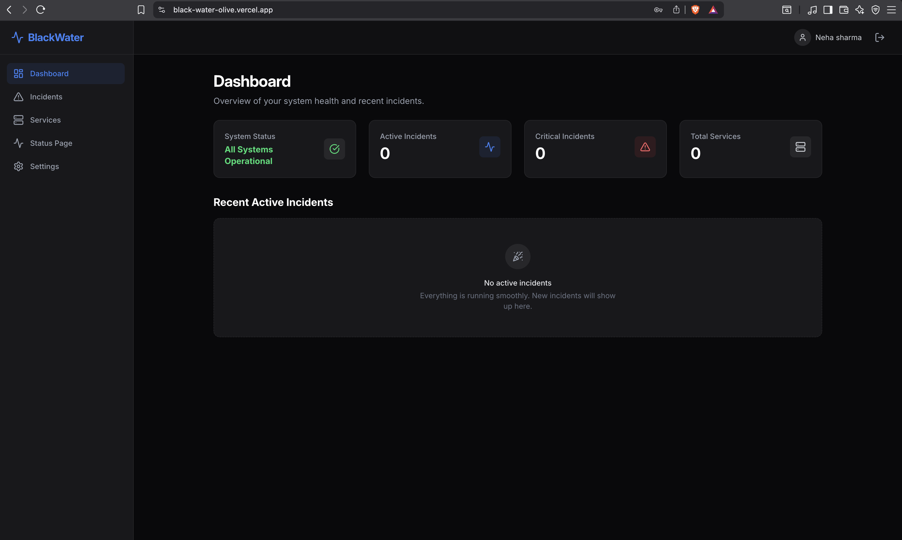
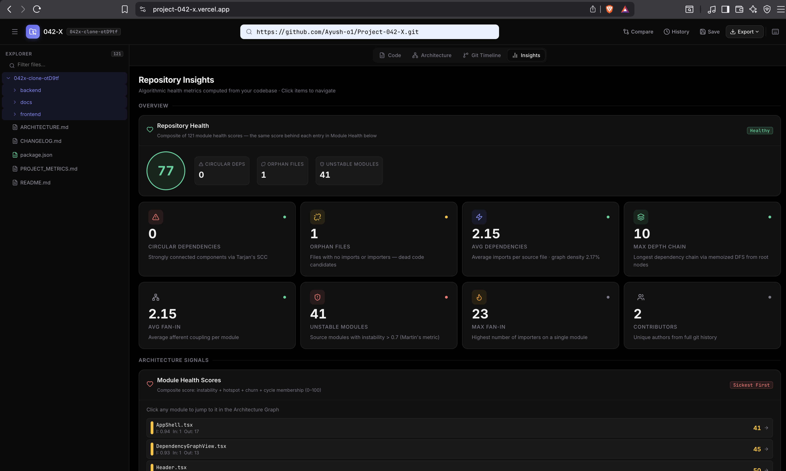

# Ayush Kumar

### Full-Stack Engineer · Node.js · PostgreSQL · Distributed Systems

B.Tech CSE '27 · Bengaluru, India

 

 

[`BlackWater`](#blackwater) &nbsp;·&nbsp; [`StarGate`](#stargate) &nbsp;·&nbsp; [`Project 042-X`](#project-042-x)

 

---

 

## Featured Projects

 

### [BlackWater](https://github.com/Ayush-o1/BlackWater) &nbsp;·&nbsp; [Live Demo](https://black-water-olive.vercel.app/)

**Multi-tenant incident management where the lifecycle is a strict state machine — tenant isolation enforced at the database layer, not just the API.**

- Multi-tenant SaaS platform serving 23 REST APIs across 9 PostgreSQL models, with organization-scoped tenant isolation returning 404 on cross-tenant resource access
- Incident lifecycle modeled as a 4-state machine, broadcasting 6 Socket.IO event types to org-scoped rooms to drive targeted React Query cache invalidation instead of polling
- JWT authentication reused for the WebSocket handshake, bcrypt-hashed credentials, 3-tier RBAC across 12 route-level checks, and two-tier rate limiting

`Node.js` `Express.js` `PostgreSQL` `Prisma ORM` `Socket.IO` `React` `Tailwind CSS`

 

---

 

### [StarGate](https://github.com/Ayush-o1/StarGate)

**Wire a DAG of HTTP calls and conditionals, hit run — Kahn's algorithm orders execution, BullMQ workers retry with backoff, SSRF defense guards every outbound call.**

- DAG-based workflow orchestration engine on Kahn's algorithm for topological sort and cycle detection, exposing 41 REST APIs over 11 PostgreSQL models in a Dockerized Turborepo monorepo
- Execution decoupled into 2 BullMQ and Redis queues consumed by a standalone worker process, with exponential-backoff retries, idempotent job IDs, and distributed cron scheduling
- DNS-pinned SSRF defense re-validates resolved IPs on every redirect before an outbound call is made

`Node.js` `Express.js` `PostgreSQL` `Prisma ORM` `Redis` `BullMQ` `React` `Docker` `Turborepo`

 

---

 

### [Project 042-X](https://github.com/Ayush-o1/Project-042-X) &nbsp;·&nbsp; [Live Demo](https://project-042-x.vercel.app/)

**Parses a JavaScript repo into an AST, finds circular dependencies with Tarjan's SCC, and renders the dependency graph without blocking the UI thread.**

- Static analysis engine parsing JavaScript repositories via AST traversal at a bounded 50-file concurrency, exposing 8 REST APIs for dependency graphs, git history, and code metrics
- Tarjan's strongly connected components algorithm (O(V+E)) detects circular dependencies; Dagre graph layout is offloaded to a Web Worker to keep the UI responsive
- Covered by 129 automated tests across 19 suites

`JavaScript` `React` `Node.js` `Express.js` `SWC` `Web Workers`

 

---

 

## Other Projects

 

**[CareIQ](https://github.com/Ayush-o1/cura-readmission-prediction)** — Predicts which patients are likely to be readmitted within 30 days of discharge, and explains why with SHAP instead of a black-box score. XGBoost scoring 0.84 AUROC on a star-schema warehouse, Airflow-orchestrated ETL.
`Python` `FastAPI` `XGBoost` `Airflow` `PostgreSQL`

**[AutoPrompt](https://github.com/Ayush-o1/auto-Prompt)** — Treats prompt engineering as a versioned software artifact: YAML-driven prompts with automated scoring on every commit.

**[SwitchBoard](https://github.com/Ayush-o1/switchboard)** — Self-hosted LLM gateway that routes across OpenAI, Anthropic, Gemini, and HuggingFace with automatic failover, serving repeated prompts from a two-pass semantic cache in milliseconds at zero cost.
`Python` `FastAPI` `PostgreSQL` `pgvector` `Docker`

 

---

 

## Tech Stack

 

**Languages**

  

**Backend & Data**

  

**Frontend**

  

**Infrastructure**

  

**Core CS**

🧩 **Data Structures & Algorithms**&nbsp;&nbsp;·&nbsp;&nbsp;⚙️ **Operating Systems**&nbsp;&nbsp;·&nbsp;&nbsp;🗄️ **DBMS**&nbsp;&nbsp;·&nbsp;&nbsp;🌐 **Computer Networks**

🏛️ **OOP**&nbsp;&nbsp;·&nbsp;&nbsp;📐 **System Design**&nbsp;&nbsp;·&nbsp;&nbsp;🔗 **Distributed Systems**

 

---

 

## GitHub Activity

 

 

---

 

### Open to Software Engineer (SWE) roles — batch of 2027

 

Last Edited on: 4 July 2026

