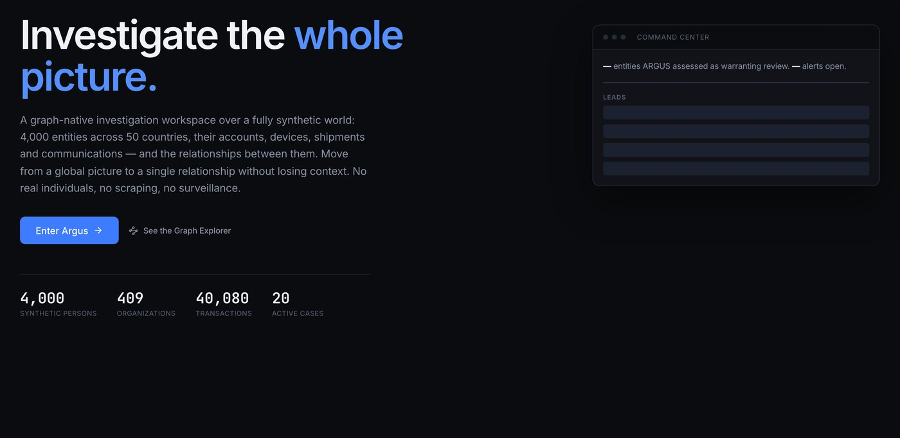
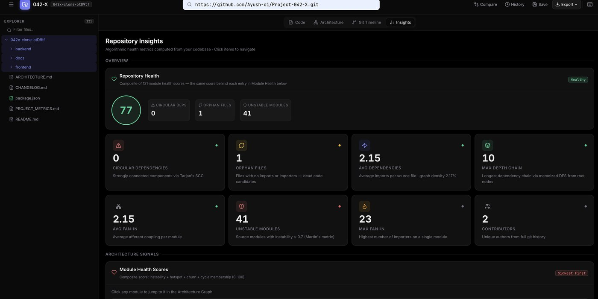
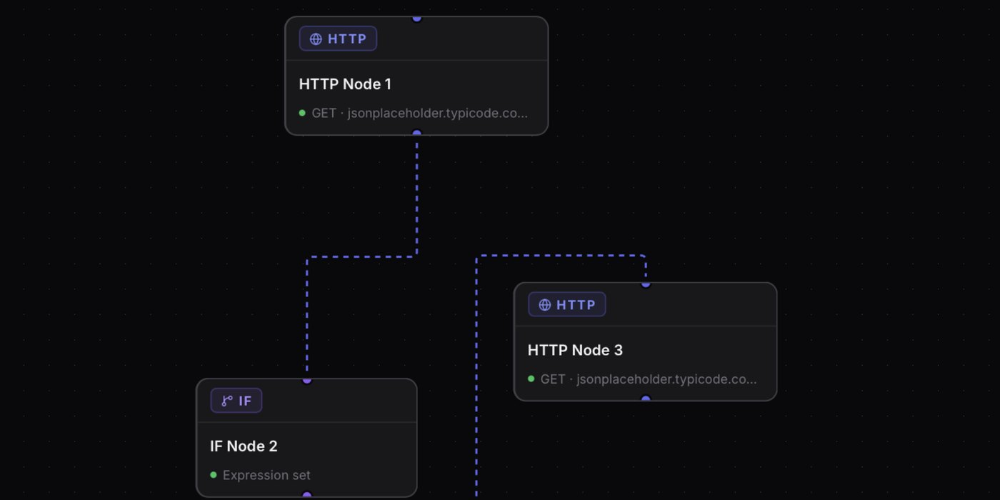
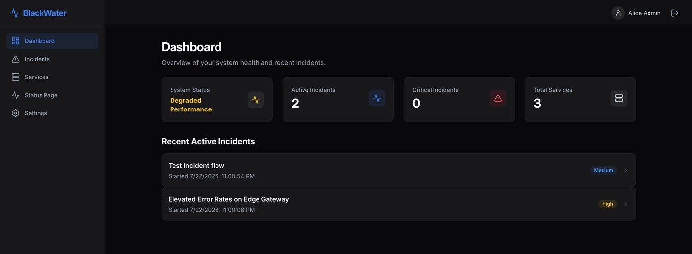

# Ayush Kumar

**Backend systems, and the proof they hold up.**

Bengaluru · B.Tech CSE 2027 · open to software engineering roles

[Portfolio](https://ayush-kumar-navy.vercel.app/) · [LinkedIn](https://linkedin.com/in/ayushh-o1) · [Email](mailto:ayushh.pvt10@gmail.com) · [LeetCode](https://leetcode.com/u/tZbaWZwiWk/)

<picture>
  <source media="(prefers-color-scheme: dark)" srcset="assets/hero-dark.svg">
  
</picture>

Velora ships this as a management command, so the claim is reproducible instead of asserted.

## Selected work

### [Argus](https://github.com/Ayush-o1/Argus) — graph investigation on synthetic data

A graph investigation platform over a world that doesn't exist — 70 cities, 50 countries, every entity procedurally generated. Neo4j and GDS run the analytics; scikit-learn finds the anomalies.

It grades its own detectors against ground truth the model never sees, and publishes the score including the cases it fails.

`Python` `FastAPI` `Neo4j` `PostgreSQL` `Next.js` — 74k lines · 55 test files · CI · 12 docs

### [Project 042-X](https://github.com/Ayush-o1/Project-042-X) — codebase intelligence

Give it a public GitHub URL. It parses every file to an AST with SWC, builds the dependency graph, and reads the git history.

Tarjan's SCC finds the circular imports; Dagre layout runs in a Web Worker so the graph doesn't freeze the tab.

`TypeScript` `React` `Node.js` `SWC` — 152 tests

**[Try it →](https://project-042-x.vercel.app/)** &nbsp;·&nbsp; the backend sleeps on free hosting, so the first run is slow

### [StarGate](https://github.com/Ayush-o1/StarGate) — workflow orchestration

Wire HTTP calls and conditionals into a DAG, hit run. Kahn's algorithm orders execution and catches cycles; a standalone BullMQ worker retries with backoff.

Outbound calls pass a DNS-pinned SSRF guard that re-checks the resolved IP on every redirect.

`TypeScript` `PostgreSQL` `Prisma` `Redis` `BullMQ` `Docker` `Turborepo`

### [BlackWater](https://github.com/Ayush-o1/BlackWater) — multi-tenant incident management

Multi-tenant incident management with a live public status page. Socket.IO events drive targeted cache invalidation instead of polling.

A cross-org request returns 404, not 403 — a 403 would confirm the resource exists.

`TypeScript` `Express` `PostgreSQL` `Prisma` `Socket.IO` `React` — CI runs against a real Postgres

Other things I've built

 

**[ContextForge](https://github.com/Ayush-o1/contextforge)** — an OpenAI-compatible proxy with semantic caching, model-tier routing and context compression. Built with three others at the RIFT hackathon, where it placed runner-up.

**[Velora](https://github.com/Ayush-o1/velora)** — session marketplace on Django 5 and Next.js 16, four containers behind one Nginx port.

**[CareIQ](https://github.com/Ayush-o1/cura-readmission-prediction)** — 30-day hospital readmission risk, explained with SHAP rather than returned as a bare score.

**[Sentinel](https://github.com/Ayush-o1/sentinel)** — spam classification for email and SMS, served behind a web UI.

## Proving it works

- **[Velora](https://github.com/Ayush-o1/velora/blob/main/DECISIONS.md)** — a `prove_concurrency` command fires N real threads at a one-seat session and reports what happened. `DECISIONS.md` records the two approaches I rejected.
- **StarGate** — `ssrf.verify.ts` walks a table of addresses and asserts each verdict. The Cloudflare case is in there because the guard got it wrong once.
- **Argus** — two planted storylines leave no signal an honest detector could reach, so their recall is 0, printed with the reason beside it.

## What I build with

<picture>
  <source media="(prefers-color-scheme: dark)" srcset="assets/flow-dark.svg">
  
</picture>

## Reaching me

Email is fastest — [ayushh.pvt10@gmail.com](mailto:ayushh.pvt10@gmail.com) — or [LinkedIn](https://linkedin.com/in/ayushh-o1) and [my portfolio](https://ayush-kumar-navy.vercel.app/).

Last updated: 28 August 2026
